class: center, middle

Retrouvez les matériaux sur https://github.com/datactivist/greenpeace-formation/

Ces slides en ligne : http://datactivi.st/greenpeace-formation/seminaire.html

Les productions de Datactivist sont librement réutilisables selon les termes de la licence [Creative Commons 4.0 BY-SA](https://creativecommons.org/licenses/by-sa/4.0/legalcode.fr).

---
## Open data : Un trésor méconnu et sous exploité
[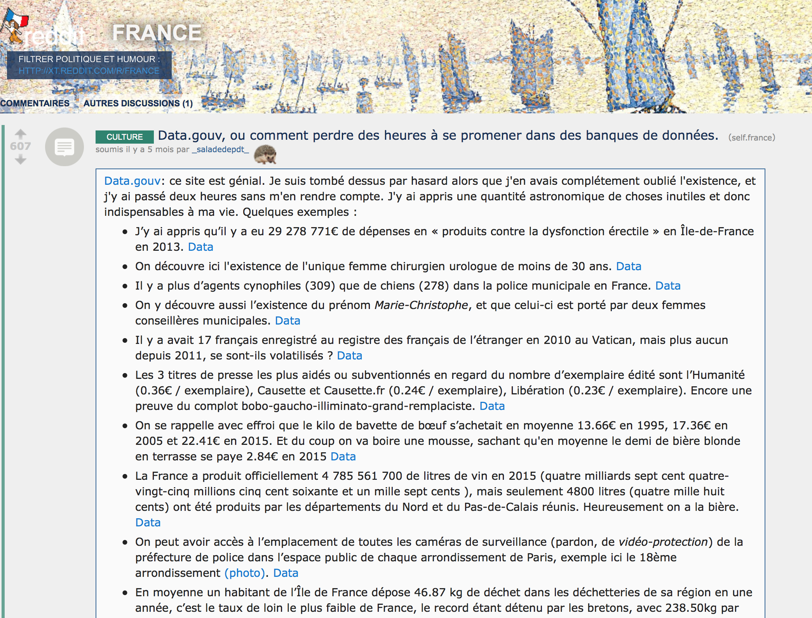](https://www.reddit.com/r/france/comments/5ing61/datagouv_ou_comment_perdre_des_heures_%C3%A0_se/)
???
Vous êtes probablement déjà allé sur un portail open data et peut etre que vous avez été déçu par les données que vous y avez trouvé. J'ai été très surpris par ce message qui est resté en une de Reddit France où l'auteur montre des faits intriguants à partir de data.gouv.fr
--> vous montrer que l'open data peut révéler de nouvelles choses ou vous permettre les choses sous un autre angle
---
# Mobiliser avec des données
###Exemple : Mejora tu escuela (Mexique)
[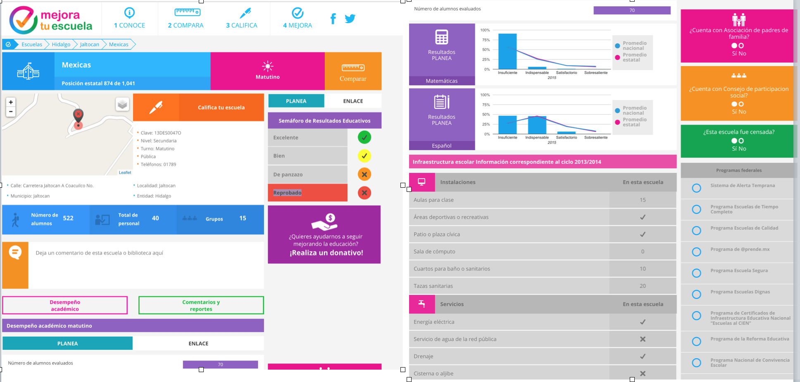](http://www.mejoratuescuela.org/escuelas/index/13DES0047O)
.footnote[appuyer sur la touche `p` pour obtenir des détails sur le projet]
???
 vu dans la[ 4ème édition du rapport annuel d'Open Data Barometer](http://opendatabarometer.org/doc/4thEdition/ODB-4thEdition-GlobalReport-FR.pdf):

L’initiative pour l’éducation Mejora tu Escuela (« Améliore ton école ») est une plateforme en ligne qui donne des renseignements aux citoyens sur les résultats des écoles. Elle a comme objectif principal d’aider les parents. Elle permet aux utilisateurs de comparer les données de 163 785 bases différentes pour aider à la prise de décision en matière d’éducation et améliorer l’éducation des enfants. 

Le pouvoir décisionnel des parents a été renforcé et l’initiative a également permis d’exercer un contrôle plus efficace et de réduire la corruption dans le système éducatif mexicain. Outre les parents, d’autres acteurs importants, dont les enseignants, les décideurs politiques et les organisations de la société civile utilisent ces données pour analyser et évaluer les performances des élèves actuellement scolarisés, afin de renforcer, voire de réformer, le système scolaire. 

Le Mexique a un taux d’obtention du diplôme de fin d’études secondaires plus bas que la moyenne des pays de l’OCDE. Améliorer ce résultat est donc un objectif prioritaire et un outil comme Mejora tu Escuela peut contribuer à y parvenir. 

---
# Mobiliser avec des données
###Exemple : Paysages de France
.reduite2.center[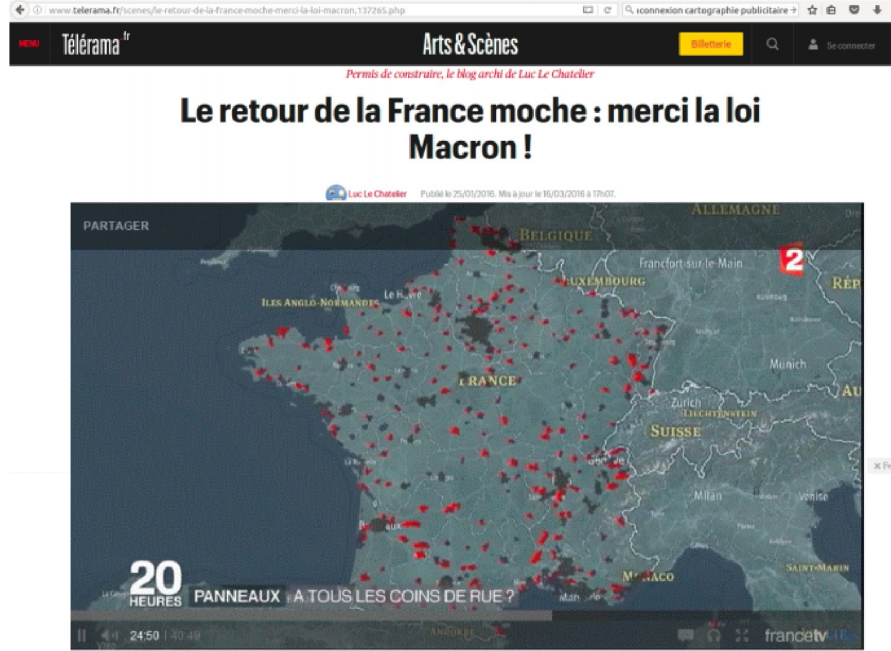]
.footnote[`p` pour obtenir 
des détails]
???
Voir la [présentation à l'OGP](http://pdfext.github.io/OGP2016/PitchCorner_OpenData_Thursday_December_8th__9_30_AM.pdf)
Tout ceci se passe fin 2015 et début 2016.

L'association 'Paysages de France' qui défend depuis plus de 25 ans le paysage contre toutes formes de pollution visuelle et notamment celle qui est due aux panneaux publicitaires, est informée fin août 2015 d'un projet de décret gouvernemental sur l'affichage publicitaire.

Après avoir compris la portée de ce projet de décret, préparé sans nul doute par les lobbies publicitaires qui régulièrement essayent de faire évoluer la réglementation en leur faveur, l'association engage toutes ses forces pour s'y opposer, et commence alors une course de vitesse et une lutte de plus de 6 mois.

Il faut évaluer, pour chacun des territoires français, la portée exacte de ce projet de décret, et il faut ensuite faire connaître au plus grand nombre cette étude d'impact. Que chacun puisse juger !

Pour ceci les données ouvertes sur les unités urbaines, les communes, sur la population, sur les Parcs Naturels Régionaux s'avèrent indispensables, la réglementation se basant sur ces données pour établir des seuils d'autorisation ou d'interdiction.

Ces données récupérées sur la plateforme OpenData du gouvernement servent à établir une cartographie complète du projet de décret, en ligne et interactive, extrêmement éloquente : les communes ou les PNR qui seraient concernés apparaissent alors très clairement. Les effets de ce projet sautent alors aux yeux de tous, et leurs aspects très néfastes ! Cette cartographie est reprise progressivement par un grand nombre de médias nationaux et provinciaux, jusqu'aux JT de France3 et au JT du 20h de France2, et a ainsi contribué de manière décisive à la prise de conscience du public.

Cette cartographie s'est rajoutée à toute une panoplie d'actions de l'association Paysages de France.

La transparence et l'évaluation objective manquaient vraiment dans ce projet gouvernemental. Devant sa réalité dévoilée aux yeux de tous, le gouvernement a dû finalement renoncer à tous les articles de ce projet de décret (sauf un article relatif à la publicité autour des grands stades dans le cadre de l'Euro 2016, article qu'il faut continuer de dénoncer) et donc notamment renoncer complètement à étendre les zones où l’installation de panneaux publicitaires au sol de grand format aurait été autorisée.
---
# Mobiliser avec des données
###Exemple : Transparency France - [Visualiser la corruption](https://www.visualiserlacorruption.fr/home)
.reduite2.center[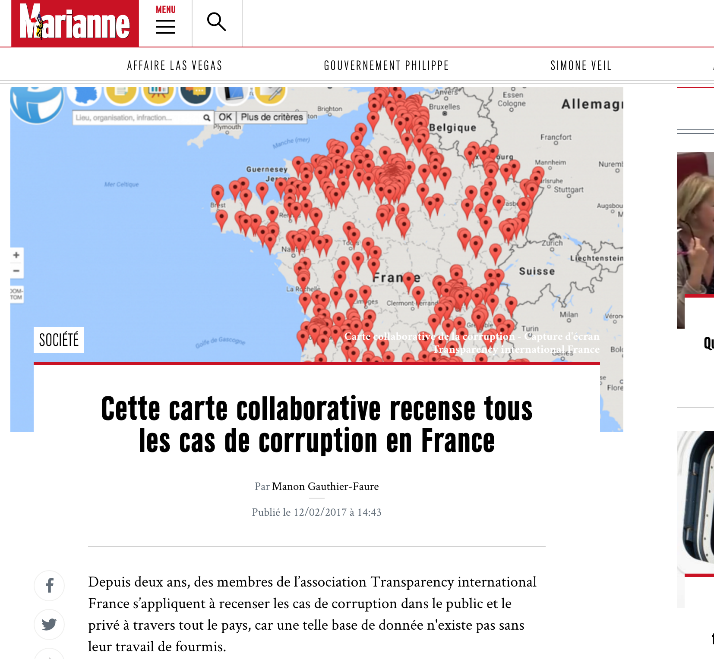]

???
Lisez cet article dans [Le Monde](http://abonnes.lemonde.fr/chronique-des-communs/article/2017/02/11/une-carte-collaborative-de-la-corruption-en-france_5078252_5049504.html) qui présente le travail des bénévoles derrière ce projet. 
---
#Objectif de la formation
📣 Exploiter les données ouvertes pour faire campagne et mobiliser

.pull-left[
**Session 1 : Ouvrir des données**
   
✅
Faire la différence entre open data et big data
   
✅ Connaitre les origines et les grands principes de l'open data
   
✅ Découvrir des bases de données ouvertes à exploiter
   ]
.pull-right[
**Session 2 : Faire ouvrir des données**
   
✅  "Just  good enough" data:  
constituer une base de données suffisante pour mobiliser
  
✅ S'appuyer sur le droit d'accès et la loi CADA
   
✅
Le crowdsourcing de données]

---
class:inverse,middle,center
# Les habits neufs des données
###Petit glossaire préalable 

---
# Les habits neufs des données
.pull-left[- **Open data** : des données numériques souvent publiques librement réutilisables par tou.te.s d'un point de vue à la fois technique (formats ouverts) et juridique (licence ouverte)
   
- **Linked data** : des données structurées définies par des ontologies sémantiques communes (chaque concept fait l'objet d'une définition) et reliées entre elles sur le web.]
.pull-right[

]
---
# Les habits neufs des données
.pull-left[- **Big data** : des données généralement privées et fermées caractérisées principalement par leur volume (téraoctets de données), la vélocité de leur traitement (temps réel) et leur variété
   
- **Data API** : une interface de programmation qui permet de se « brancher » pour échanger des données. L'API définit les règles et les limites à l'accès aux données.
]
.pull-right[

]
---
class:inverse, center, middle
#Petite histoire de l'open data
###Connaitre les principes, découvrir les acteurs 
---
#2005 : Open Definition, définir le savoir libre
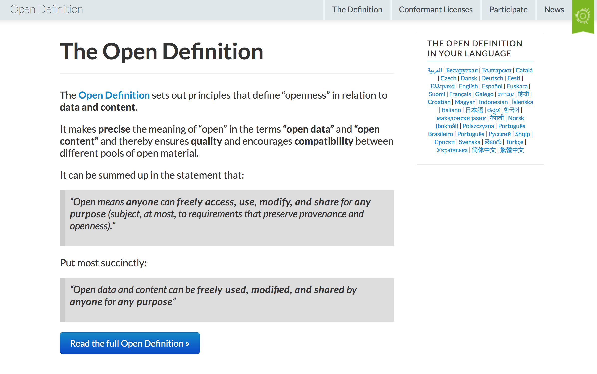
---
#2007 : Sebastopol (CA), établir les principes de l'Open Data
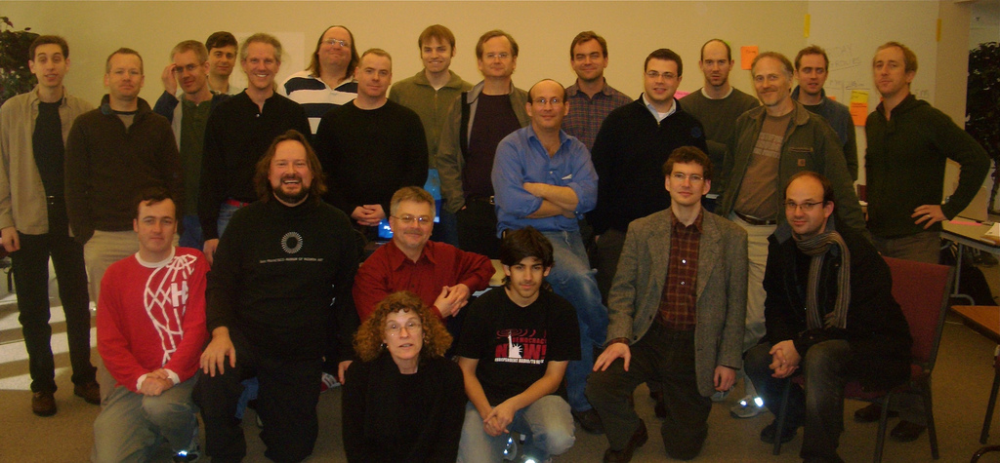
---
#2009 : Tim Berners-Lee, les données brutes sous les projecteurs
.reduite[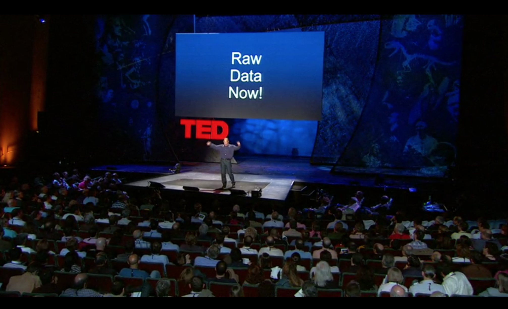]

---
#2011 : Open Government Partnership, l'internationale de l'ouverture
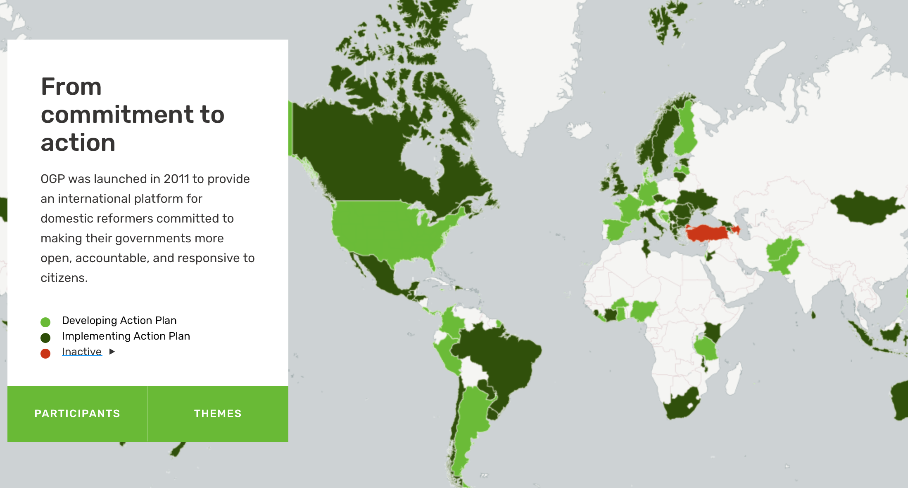
---
#2011 : Open Government Partnership, l'internationale de l'ouverture
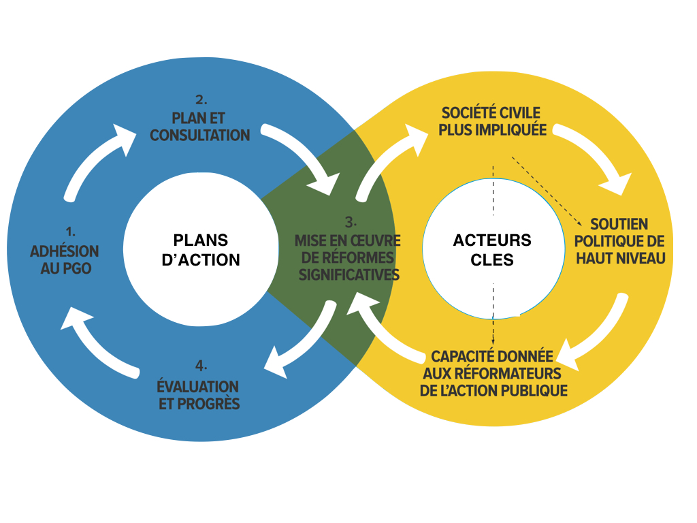
---
#2013 : G8, les chefs d'Etat s'engagent pour l'open data par défaut
.center[]
---
class:center, inverse, middle
#L'open data en France
### Cadre juridique et principaux acteurs

---
#Loi Commission d'Accès aux Documents Administratifs (1978)
- Droit d'accès aux documents administratifs s'applique à **tous les documents** quelqu'en soit la forme : les données en font partie

- S'impose à tous les organismes publics et privés **chargés d'une mission de service public**

- Porte sur les documents **existants** et **achevés**. Exclut les demandes manifestivement **abusives** (entraver l'administration), les informations sur les **personnes physiques**, le **secret industriel** et commercial et la sureté de l'Etat. 

- La demande peut se faire par **e-mail ou par courrier**, l'administration a un mois pour répondre. La CADA peut être saisie dans un **délai de deux mois** après le refus (y compris tacite). A la suite, le tribunal administratif puis le Conseil d'Etat peuvent être saisis.   

.footnote[Le [site de la CADA](www.cada.fr) explique en détail la jurisprudence et les modalités d'exercice du droit d'accès.]
---
# Les directives européennes
.pull-left[
- **Directive Public Sector Information** (2003, révisée en 2013) : définit des règles minimales pour la réutilisation des informations publiques, limite les redevances et réduit certains obstacles à la réutilisation  

- **Directive INSPIRE (2007)** a pour objectif de créer une infrastructure de données environnementales et géographiques. Impose des normes pour les métadonnées et des spécifications pour les données dans 34 thèmes.]
.pull-right[
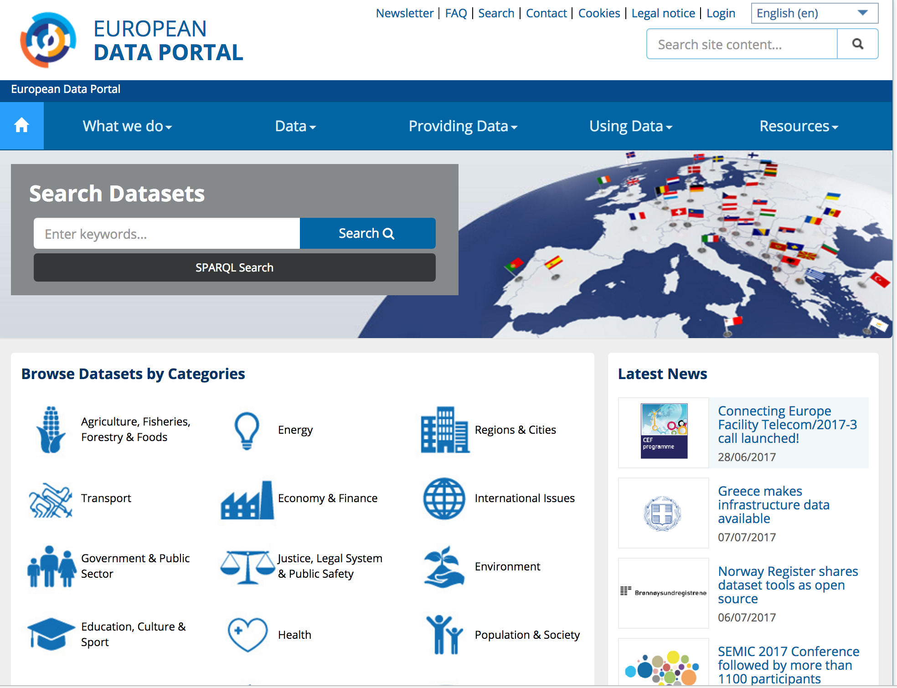
]
---
#Loi pour une république numérique (2016) : l'open data devient la norme en France

.pull-left[]
.pull-right[
Ouverture “dans un standard ouvert, aisément réutilisable et exploitable par un système de traitement automatisé” : 
- des “bases de données” : à définir
- des données “dont la publication présente un intérêt économique, social, sanitaire ou environnemental”

Obligation qui s’applique à partir de fin 2018 aux collectivités locales de 3500 habitants et aux administrations plus de 50 agents]

---
# Les licences de réutilisation
.pull-left[- Article 11 de la loi pour une République Numérique : encadre les licences open data par décret. Deux licences homologuées :

1. **La licence ouverte** :  totale liberté de réutilisation des données, y compris à des fins commerciales, des données. Impose de citer la source des données. 

2. **La licence ODBL** : dans une logique de pot commun et de réciprocité, impose de maintenir la licence sur la base de données et les modifications qui y sont apportées.] 
.pull-right[

]
---
#Etalab : de l'ouverture à la gouvernance des données
.pull-left[]
.pull-right[
- Etalab : mission en charge de l'ouverture des données publiques

- Pilote le plan d'action de la France à l'OGP

- 2014 : nomination d'Henri Verdier en tant qu'Administrateur Général des Données (Chief Data Officer)

- Startups d'Etat
]
---
#Data.gouv.fr : la plateforme ouverte des données publiques françaises
.pull-left[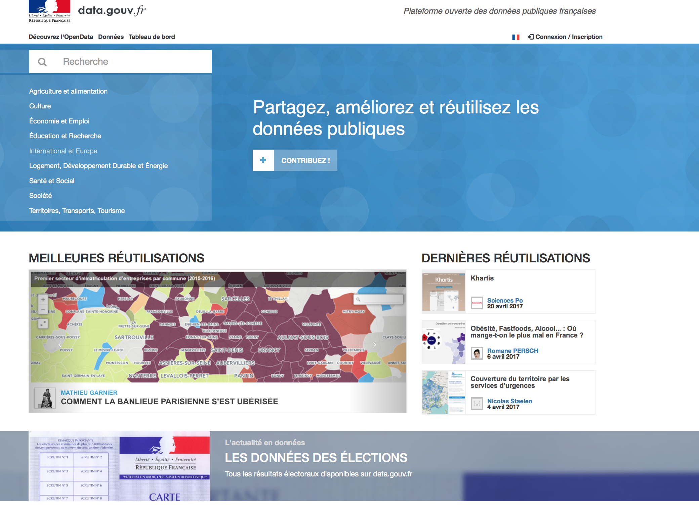]
.pull-right[
- Objectif : simplifier le partage des données de l'Etat

- Ouvert à toutes les contributions

- Moissonage des portails open data français

- Pas de visualisation

- Un portail destiné à un public avancé 
]
---
## L'ouverture des données des collectivités locales 
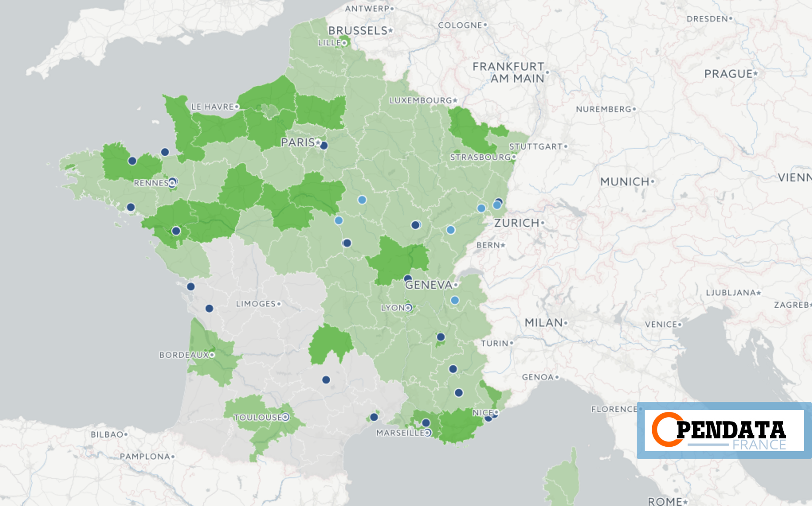
---
class:center, inverse, middle
#Sélection de données ouvertes
### Données emblématiques hors du domaine de l'environnement
---
#La base SIRENE
.reduite[.center[]]
---
#La base SIRENE : exemple de cas d'utilisation
.reduite[.center[]]
---
#Les marchés publics
.reduite[.center[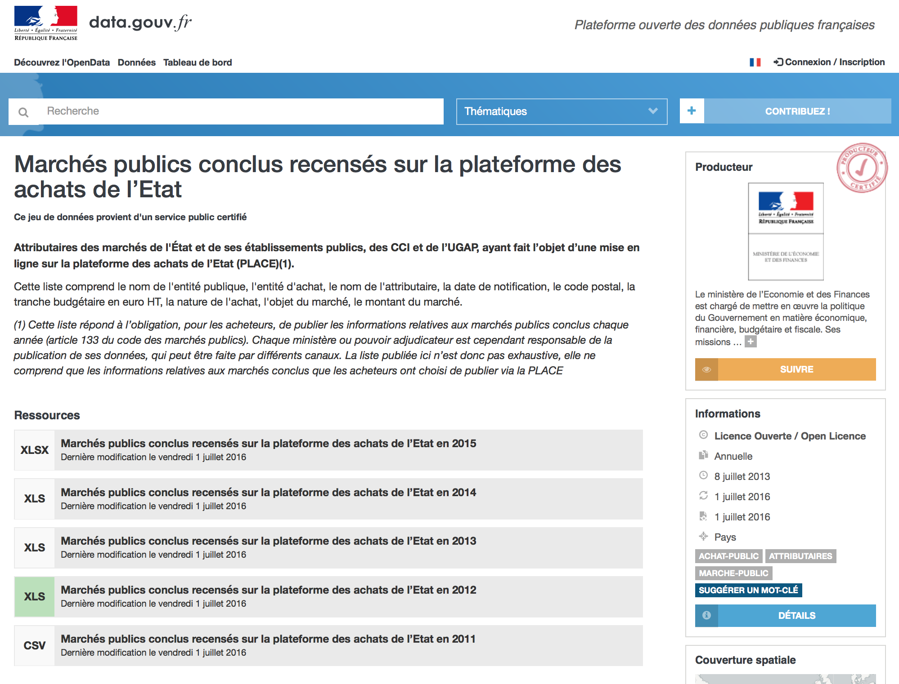]]
---
#Les marchés publics
.reduite2[.center[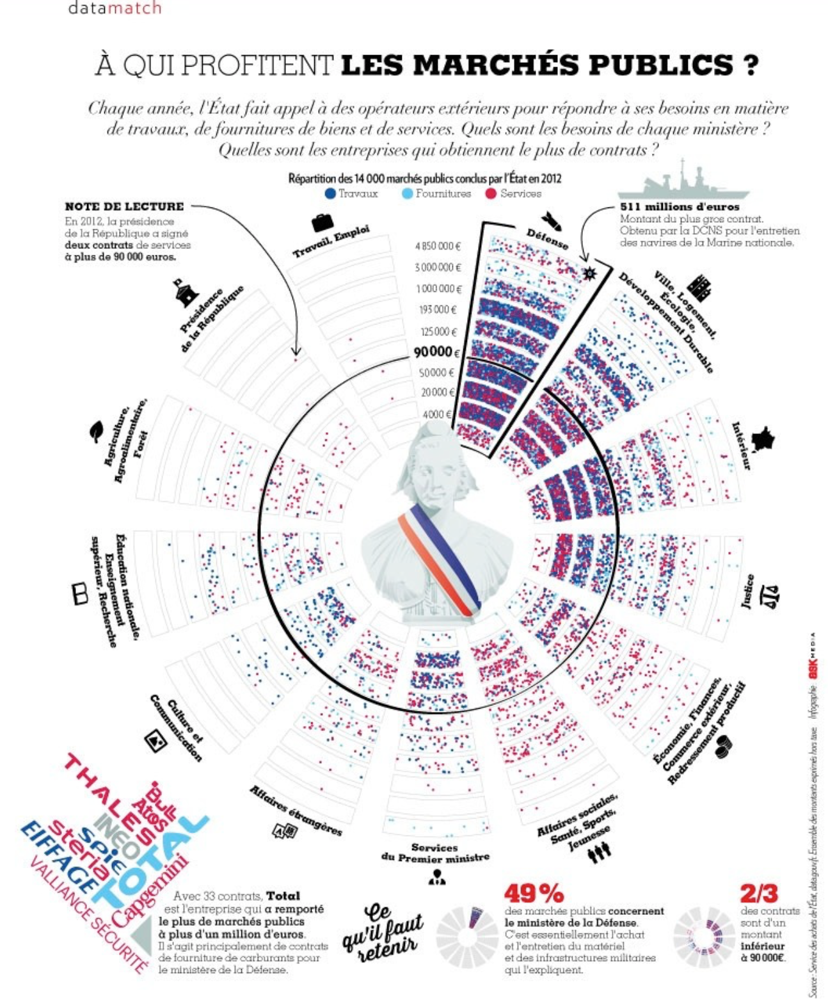]]
---
#Les inspections des restaurants
.reduite2[.center[]]
.footnote[[Résultats des contrôles officiels sanitaires : dispositif d'information « Alim’confiance »](https://www.data.gouv.fr/fr/datasets/resultats-des-controles-officiels-sanitaires-dispositif-dinformation-alimconfiance/)]
---
#Les inspections des restaurants
.reduite2[.center[]]
.footnote[[26 établissements au niveau d'hygiène à corriger de manière urgent ](https://dgal.opendatasoft.com/explore/embed/dataset/export_alimconfiance/map/?disjunctive.app_libelle_activite_etablissement&disjunctive.filtre&refine.synthese_eval_sanit=A%20corriger%20de%20mani%C3%A8re%20urgente&location=6,47.24195,5.00977&static=false&datasetcard=true)]

---
#La base transparence santé
.reduite[.center[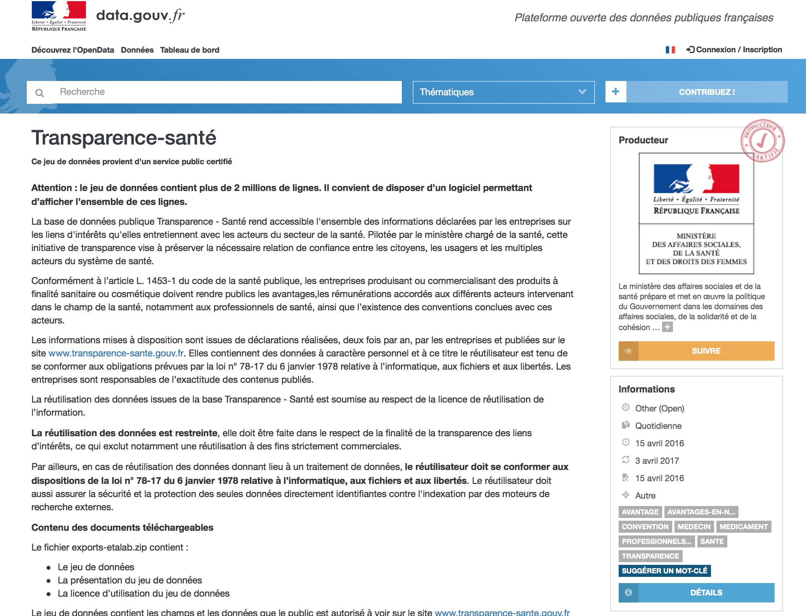]]
---
#La base transparence santé
.reduite2[.center[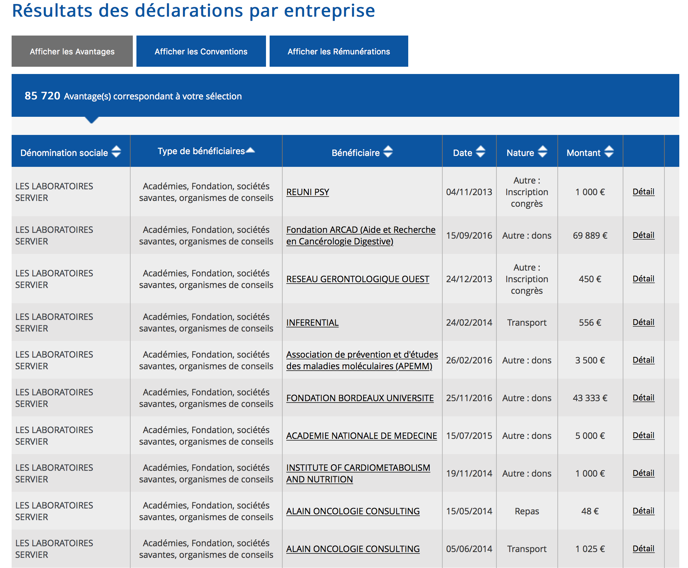]]

---
class:inverse, middle, center
# Sélection de données ouvertes
### Agriculture
---
# IGN : registre parcellaire graphique 
[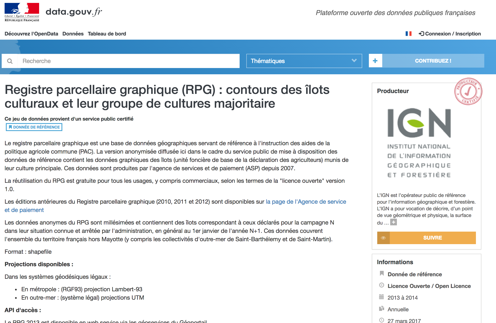](http://www.data.gouv.fr/fr/datasets/registre-parcellaire-graphique-rpg-contours-des-ilots-culturaux-et-leur-groupe-de-cultures-majoritaire/)
---
# IGN : registre parcellaire graphique 
[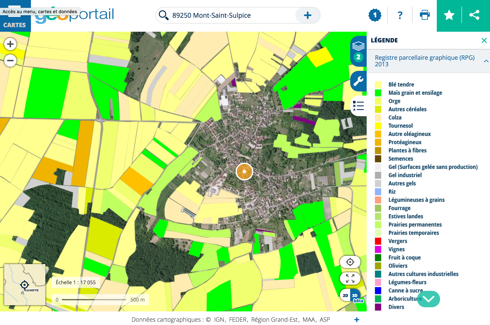](https://www.geoportail.gouv.fr/carte?c=4.200599069655903,45.796124429708925&z=13&l0=ORTHOIMAGERY.ORTHOPHOTOS::GEOPORTAIL:OGC:WMTS&l1=LANDUSE.AGRICULTURE2013::GEOPORTAIL:OGC:WMTS&permalink=yes)
---
# E-phy : le catalogue des produits phytosanitaires
[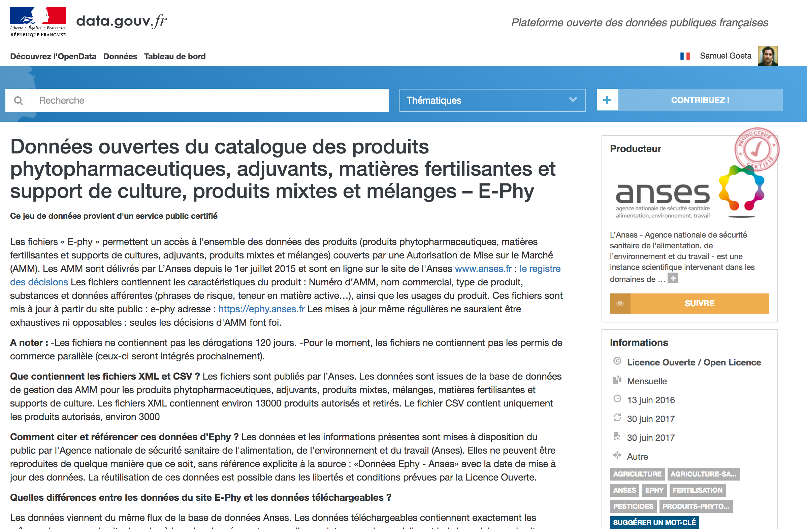](https://www.data.gouv.fr/fr/datasets/donnees-ouvertes-du-catalogue-des-produits-phytopharmaceutiques-adjuvants-matieres-fertilisantes-et-support-de-culture-produits-mixtes-et-melanges-e-phy/)

---
# Agence bio : production animale et végétale par département
.pull-left[
[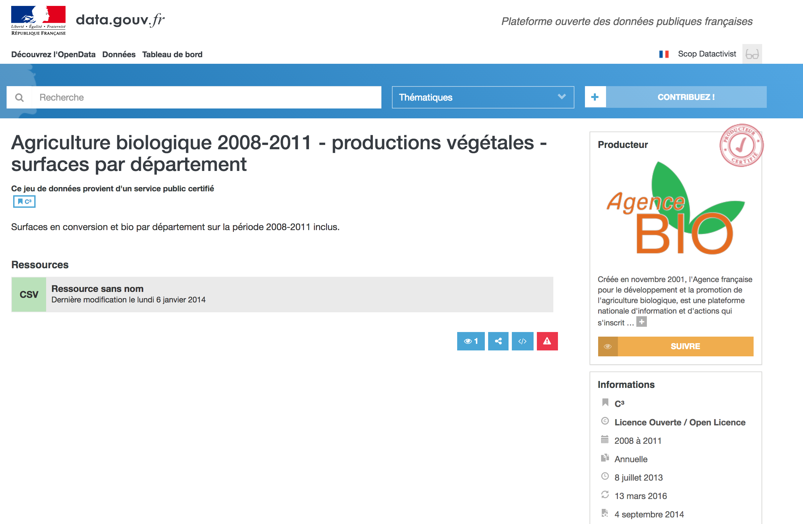](https://www.data.gouv.fr/fr/organizations/agence-bio/)]

.pull-right[
- Des données agrégées au département

- Des données obsolètes : 2011

- Nouvelle initiative en septembre : espoir de mise à jour
]

class:inverse, middle, center
# Sélection de données ouvertes
### Environnement
---
# Ademe : les émissions des véhicules commercialisés en France
[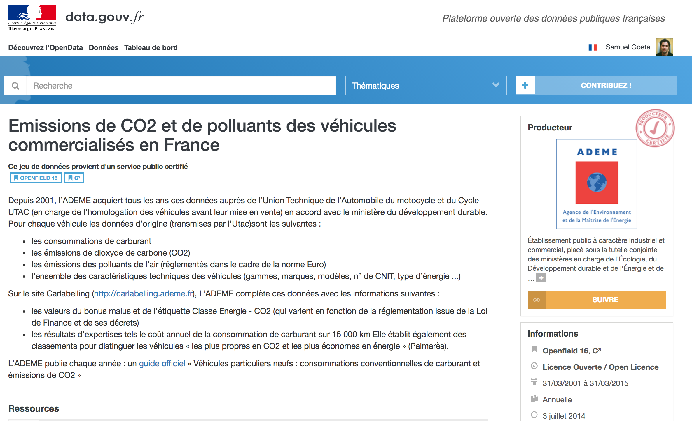](https://www.data.gouv.fr/fr/datasets/emissions-de-co2-et-de-polluants-des-vehicules-commercialises-en-france/)
---
# Ademe : les émissions des véhicules commercialisés en France

---
# Ademe : la base Carbone
.pull-left[
[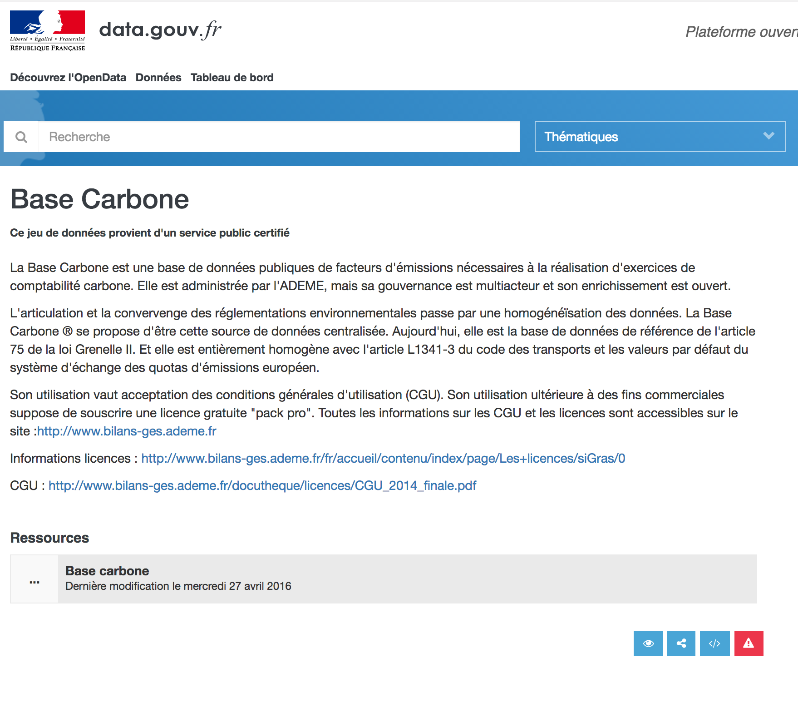](https://www.data.gouv.fr/fr/datasets/base-carbone/#discussion-5721143a88ee382962a19f12-1)
]
.pull-right[
- Recense plus de 1 300 facteurs d’émissions pour la France métropolitaine

- Permet de convertir des activités en kilogrammes équivalent CO2

- Licence interdit usages commerciaux : 🤔pas de l'open data
]
---
#IGN : inventaire forestier
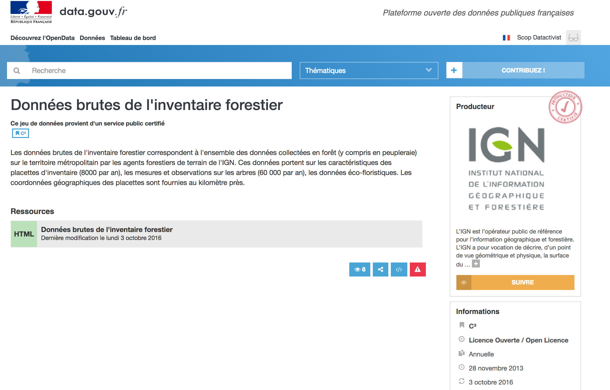
---
#CGDD : concentrations en nitrates
[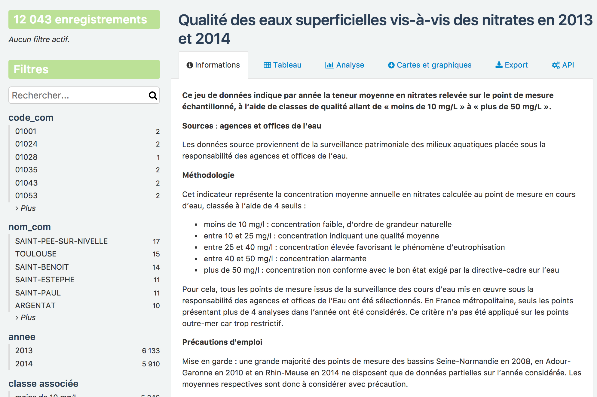](https://data.statistiques.developpement-durable.gouv.fr/explore/dataset/eau_qual_sup_nit/information/)
---
#CGDD : concentrations en nitrates
[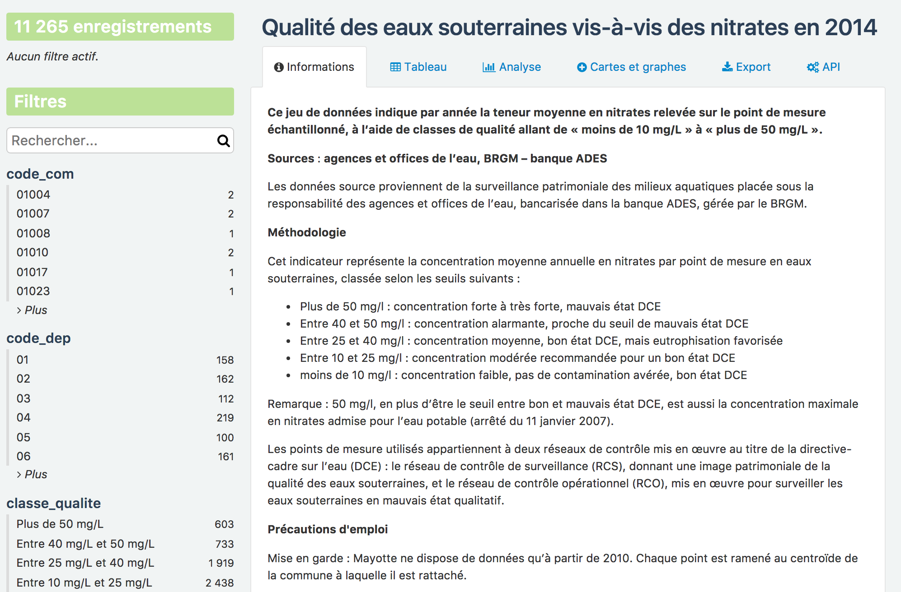](https://data.statistiques.developpement-durable.gouv.fr/explore/dataset/sout_nit_ref/information/?disjunctive.code_com&disjunctive.code_dep&disjunctive.classe_qualite&disjunctive.niveau)
---
# La base des polluants de Joel 

---
class:inverse, middle, center
#Sélection de données ouvertes
### Energie
---
class:inverse, middle, center
#L'open data par défaut : un mirage ?

---
#Une obligation sans moyens dédiés
.pull-left[
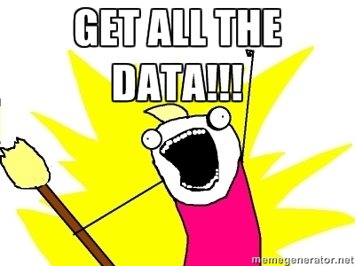
]
.pull-right[
- Un travail sous-évalué 

- Un travail qui n'entre pas dans les missions des agents

- Une transition vers l'open data par défaut peu préparée
]
---
#La qualité des données

.pull-left[
- Des retours des usagers difficilement pris en compte

- Encore trop de fichiers inexploitables

- Des données trop souvent agrégées : la quête des données brutes 
]
.pull-right[
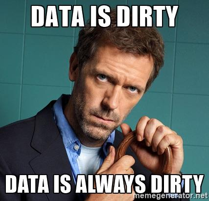
]
---
#La loi CADA doit être renforcée et mieux connue
.reduite2[.center[]]

---
#Vers un open data de la demande

---
class:inverse,center,middle
#Maintenant, l'open data ça évoque quoi pour vous ? 
---
class:inverse,center,middle
#Merci !